# Flowform

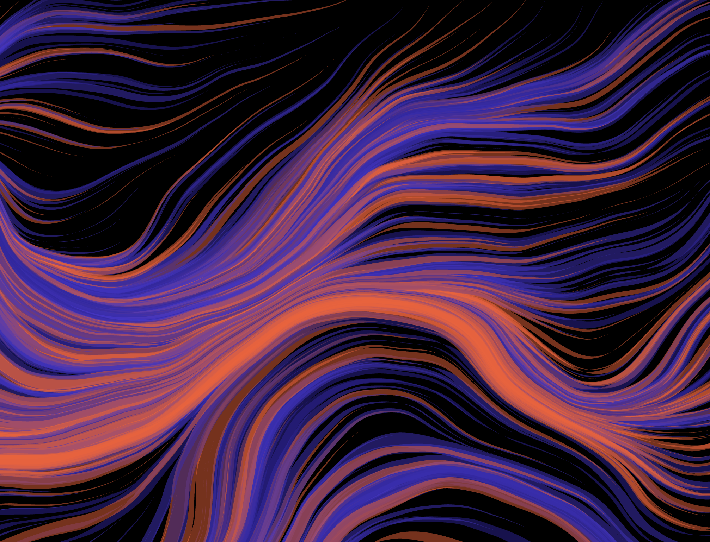
*A generative art tool for creating organic flow field compositions*

---

## About

**Flowform** is an interactive creative coding web tool that generates organic, flowing visual compositions using Perlin noise-based flow fields. Built with p5.js, it combines algorithmic art with an intuitive control interface, allowing artists and designers to create unique generative artwork in real-time.

---

## Features

### Flow Field Generation
- **Perlin Noise-Based Flows**: Organic, natural-looking line patterns driven by multi-octave Perlin noise
- **Adjustable Flow Scale**: Control the "zoom" level of the noise pattern (0.006–0.06)
- **Variable Line Density**: From sparse compositions to dense, intricate fields
- **Customizable Steps**: Control line length and complexity (500–4000 steps)
- **Line Type Toggle**: Switch between smooth organic curves and angular, discontinuous patterns

### Color & Ribbons
- **3-Color Palette System**: Fully customizable color pickers with hex input
- **Per-Color Visibility**: Show/hide individual colors with eye icon toggles
- **Random Color Generator**: One-click palette randomization
- **Ribbon Density Control**: Adjust the number of colored shapes (0.01–1.0)
- **Opacity Control**: Fine-tune transparency (0–100%)

### Visual Effects
- **Background Options**: Toggle between light and dark backgrounds
- **Flow Line Visibility**: Show or hide the underlying flow field lines
- **Pixel Sort Effect**: Glitch-art distortion with adjustable threshold and direction (horizontal/vertical)

### Interface
- **Resizable Sidebar**: Drag to resize the control panel (180px–720px)
- **Side Switching**: Move sidebar between left and right edges
- **Collapsible Sections**: Organize controls into expandable categories
- **Help Tooltips**: Contextual explanations for each parameter

### Export & Utilities
- **PNG Export**: Save compositions with optional transparent backgrounds
- **Keyboard Shortcut**: Quick export with `Cmd/Ctrl + S`
- **Regenerate**: Create new random compositions while keeping settings

---

[Archive ReadMe des anciens rendus]

# creative-coding-webtools
Noa Dufresne

## Rendu 1 - Exploration du sujet et Snippets
### ✳ L'idée, en quelques mots
- Flows de particules (& perlin noise)
- Formes organiques
- Couleurs
- [nice to have] Effets de glitch (Pixel Sorting)

##### Références
- [Oeuvres de Tyler Hobbs](https://www.lerandom.art/editorial/tyler-hobbs-on-algorithmic-aesthetics)
- [Perlin Noise Flow Field, The Coding Train](https://thecodingtrain.com/challenges/24-perlin-noise-flow-field)
- [Getting Creative with Perlin Noise Fields, sighack](https://sighack.com/post/getting-creative-with-perlin-noise-fields)
- [A look into Flow Fields, Medium](https://haneeen.medium.com/a-look-into-flow-fields-cf4a5663b831)

  
##### Images moodboard

  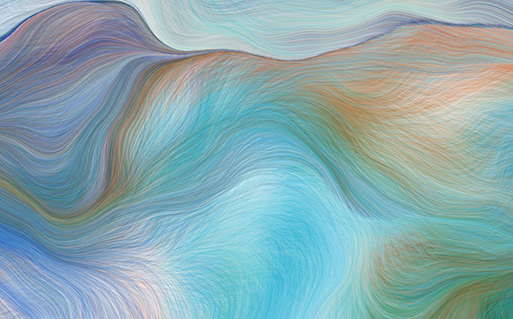
  
  
  

  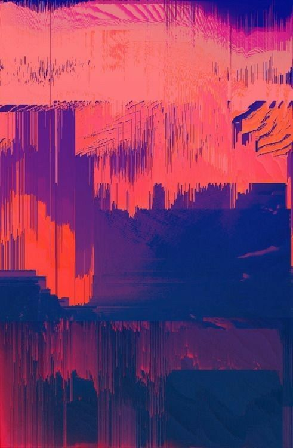
  
  
  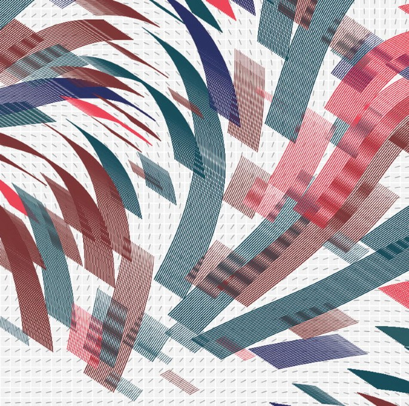

 

### ✳ Description du projet
Ce projet est un outil créatif permettant de générer des visuels à partir d’un champ de flux basé sur le bruit de Perlin.
Ces visuels combinent des lignes générées par le bruit de Perlin et des formes colorés qui suivent certaines de ces lignes.

L’utilisateur peut modifier la densité, la largeur ou les couleurs, et afficher ou masquer les lignes et les formes colorées.
 

###### Si possible à ajouter:
- Ajout d'un effet de glitch (Pixel Sorting) par dessus les formes générées
- Changer l'épaisseur des lignes
- Remplacer les applats de couleurs par des patterns (pointillés, rayures...?)
 

###### Premières idées de réglages UI
L’outil propose un panneau de contrôle qui permet d’ajuster facilement chaque aspect de la génération visuelle.

L’utilisateur pourra modifier en temps réel :

- La résolution du champ de flux (taille de la grille)

- La longueur et la fluidité des lignes

- La densité des formes générées (nombre de formes)

- La largeur des formes

- L’affichage (ou non) des lignes du flow field

- Le choix des couleurs (ou variation automatique)

- L’activation de l’effet Pixel Sorting et son intensité

- La régénération complète du visuel

*ⓘ Pour ajuster rapidement les paramètres lors de mes expérimentations (comme la densité du flow field, la longueur des lignes etc..), j’ai utilisé un petit panneau de contrôle générique via une librairie GUI : `const gui = new dat.GUI();`
Cela m’a permis de tester visuellement les réglages sans modifier le code à chaque fois.*

### ✳ Snippets

##### Génération du Perlin noise
Ce snippet montre comment le bruit de Perlin est utilisé pour créer des directions "random" et organiques dans le champ de flux.
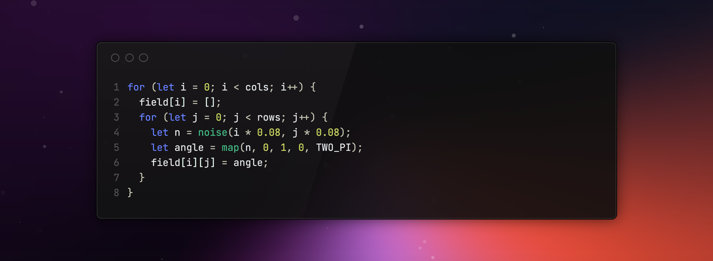
 

##### Génération d’un champ de flux
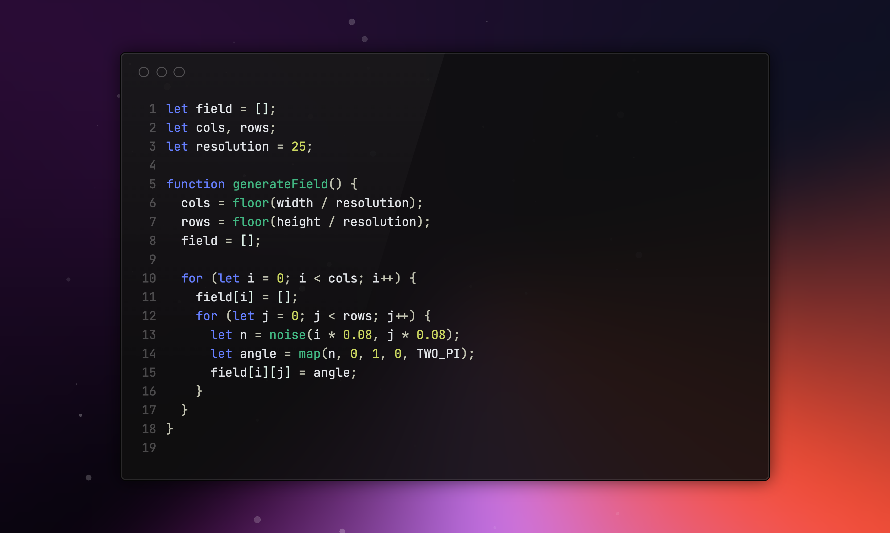

##### Tracer les lignes du flux
Calcule le chemin que suivra chaque ligne en suivant la direction du champ de flux généré par le bruit de Perlin.

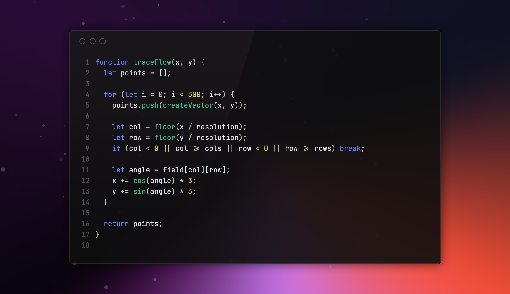
 

##### Dessiner les lignes
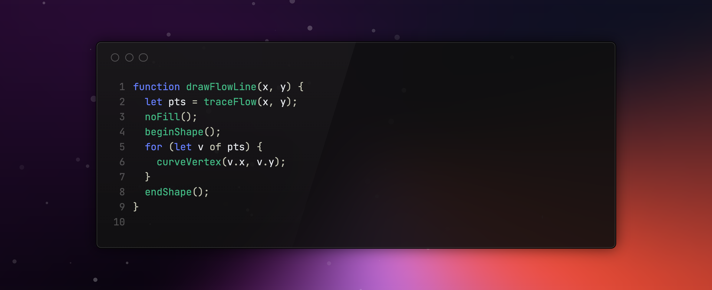
 

##### Créer des formes colorées suivant le flow
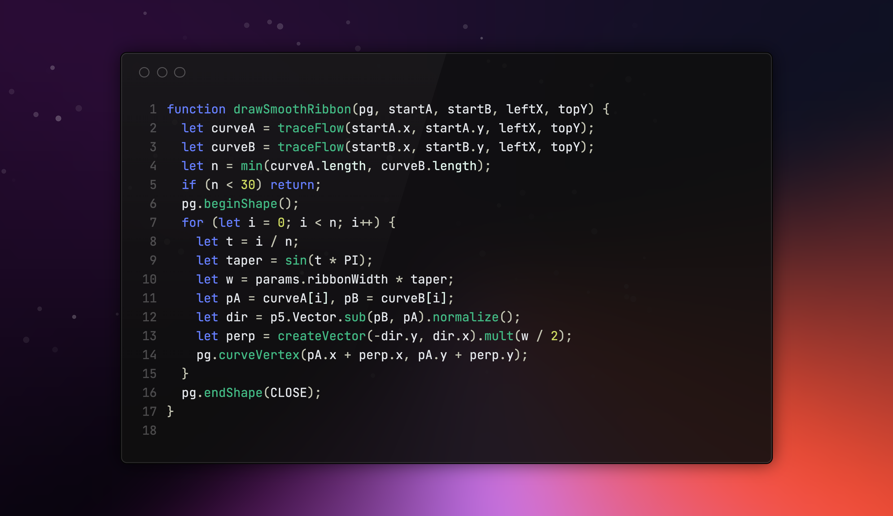
 

##### Effet de Pixel sorting
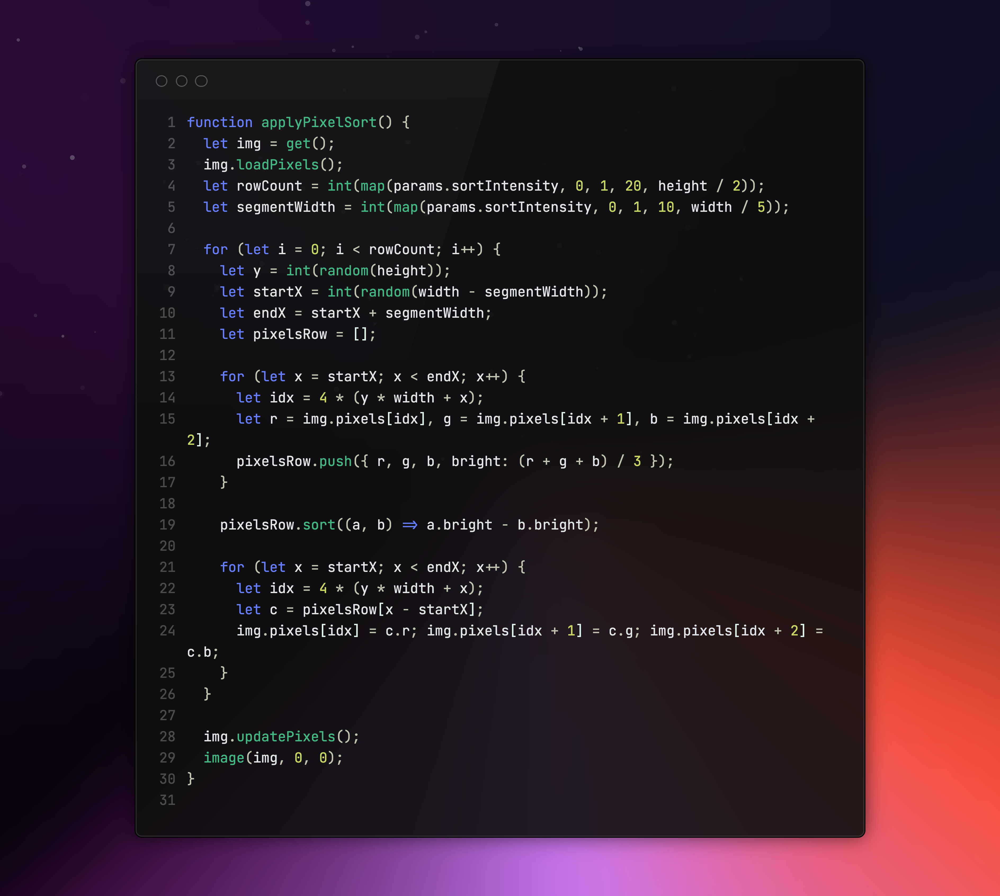
[Source de ce snippet de pixel sorting, par Patt Vira](https://www.youtube.com/watch?v=nNQk9AMYYGk)
 

#### Première expérimentations codées en utilisant les snippets

##### Flow field + perlin noise

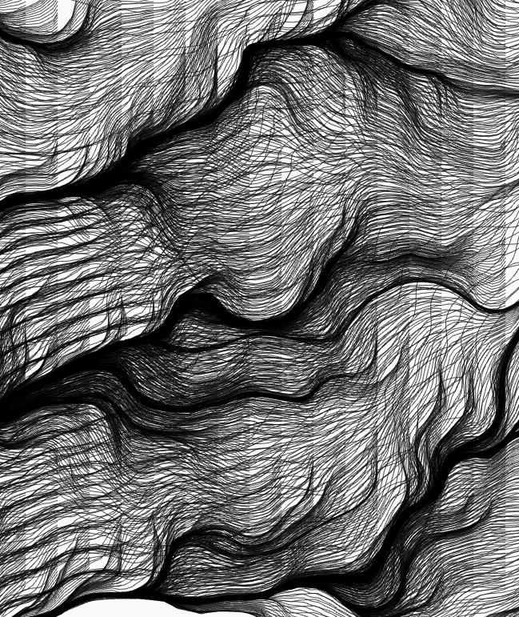

##### Avec formes colorées

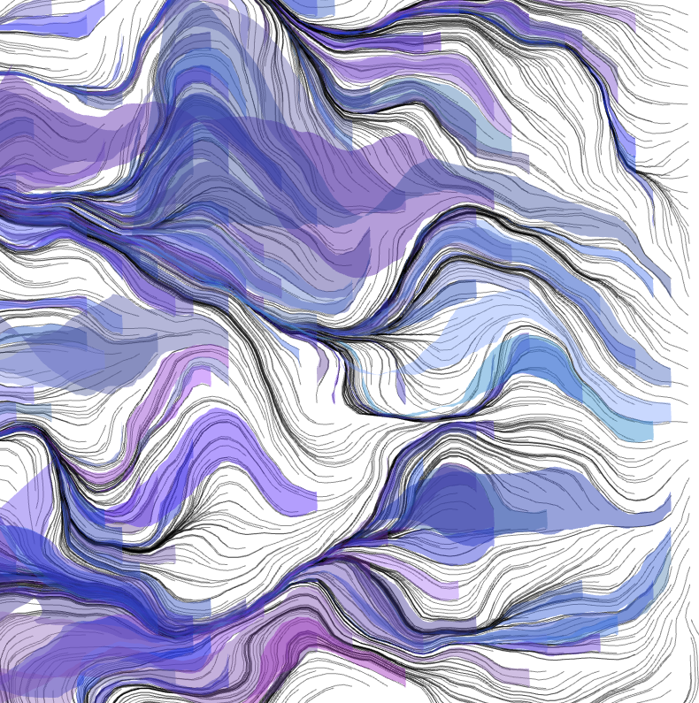

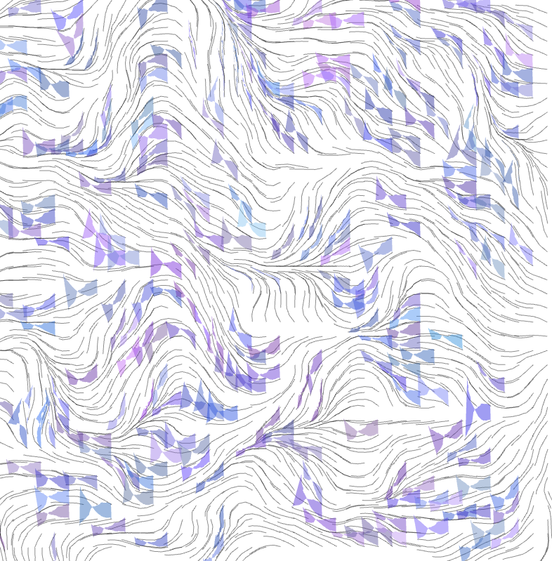

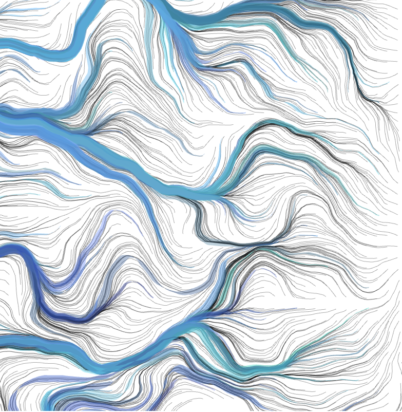

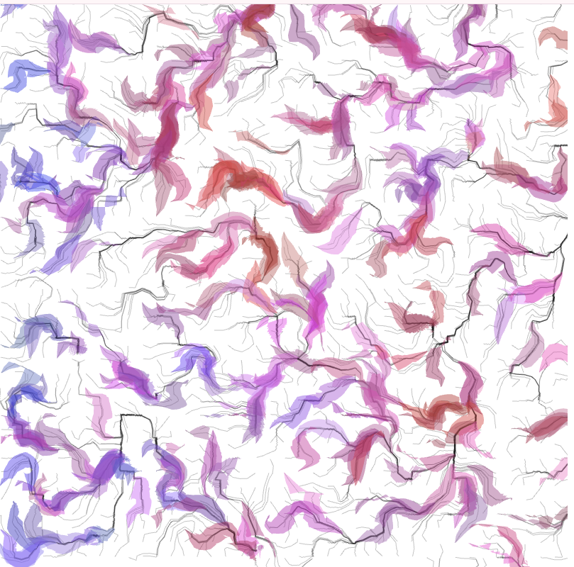

*En masquant les lignes de flux*
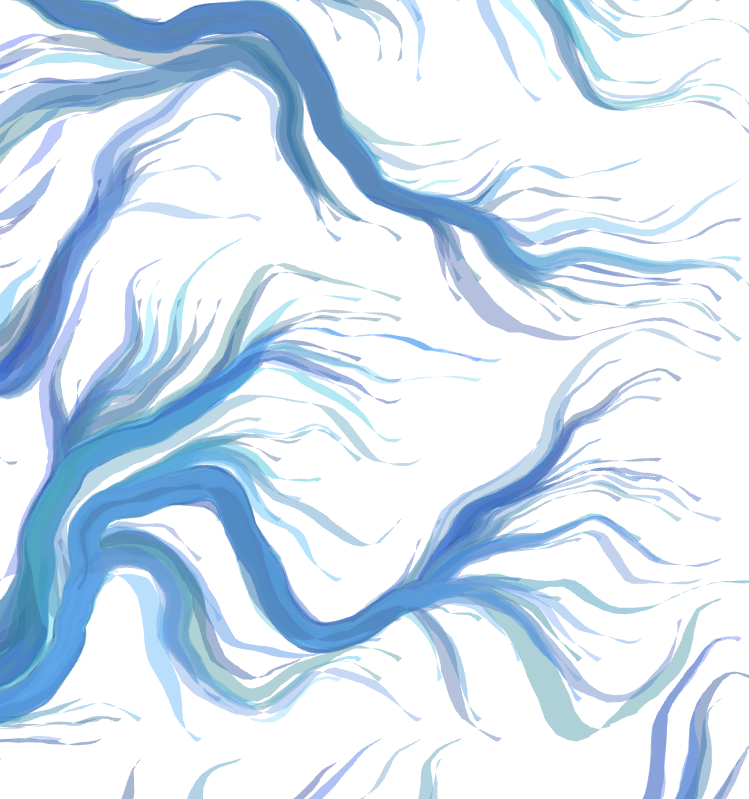

##### Avec effet de Glitch (via pixel sorting)

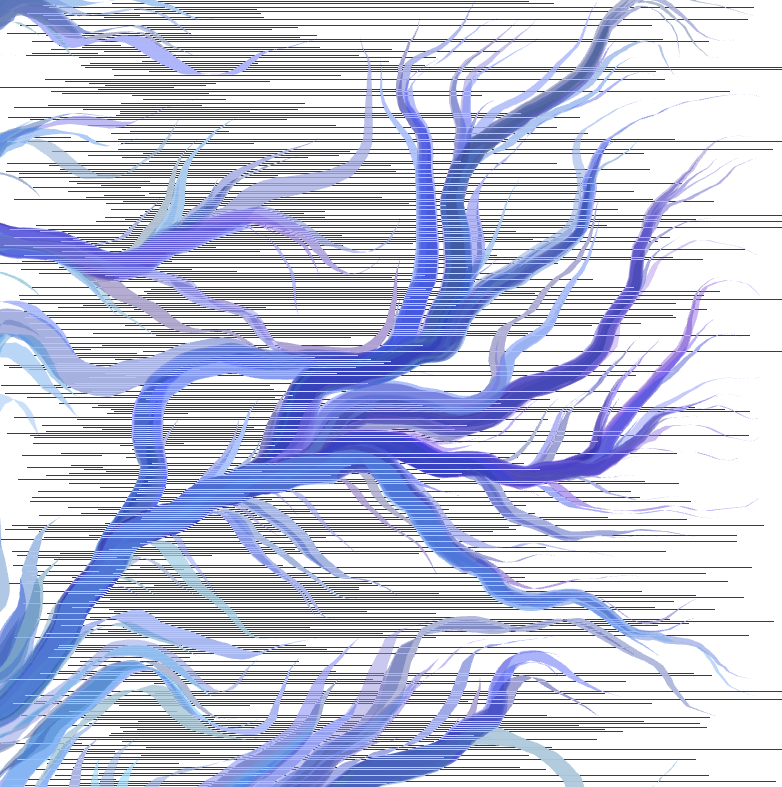

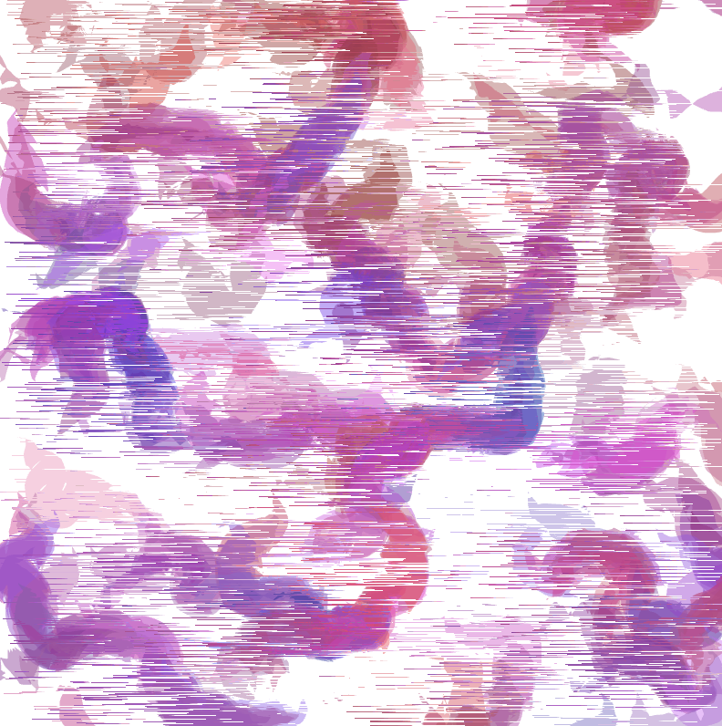

## Rendu 2 - Avancement du code / experimentations

A partir de mes premières idées et snippets, j'ai commencé a implémenter toute les fonctionnalités de mon projet en code.

Les snippets de base ont évolués dut a la complexité de certaines fonctionnalité, j'ai également décidé de split mes fichiers javascript en 2: sketch.js (la base du canva), et controls.js qui se focus sur les controles situés dans la side bar.

##### La sidebar

Je me suis penchée sur l'UI de la barre de controle du site ainsi que tous les settings que je voulais y mettre. 

La sidebar contient des sections que l'on peut activer/désactiver, tel que les couleurs et le pixel sorting. (en cliquant sur le [+] ou [-])

J'ai d'abord réalisé une maquette figma de ce menu pour ensuite l'implémenter dans mon projet.

[Lien maquette Figma](https://www.figma.com/design/pki8I9SnUcG0IiVu9puLXb/Creative-Coding---WebTool?node-id=0-1&t=WdJukAWGAjCHhk4r-1)

##### Les fonctionnalités

J'ai ajouté un setting (toggle on/off) permettant de rendre les lignes de flux **"smooth" ou "discontinuous"** (plus angulaires, moins de courbes), et également un toggle pour masquer ou afficher les lignes de flux

J'ai ajouté la fonctionnalité de changer de couleur de **background** (light/dark) via un toggle

Le **pixel sorting** est dersormais fonctionnel, avec une possibilité de changer la direction et le threshold.

J'ai également ajouté la possibilité de personnaliser **les couleurs des formes**, ainsi que leur opacité et densité

Un **bouton d'export** est placé en bas de la sidebar, avec une possibilité de switcher entre un format PNG ou SVG (pour l'instant, seul l'export .png est implémenté).

Images du rendu final:

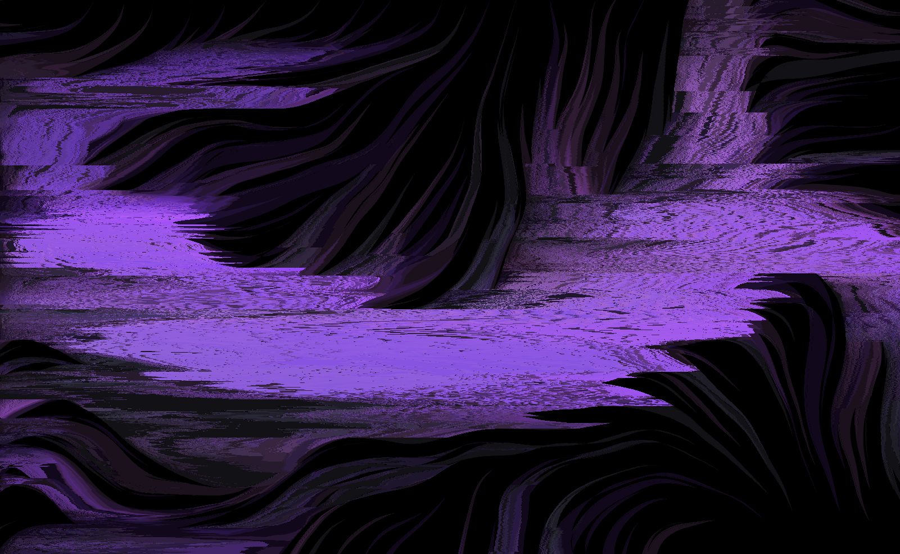
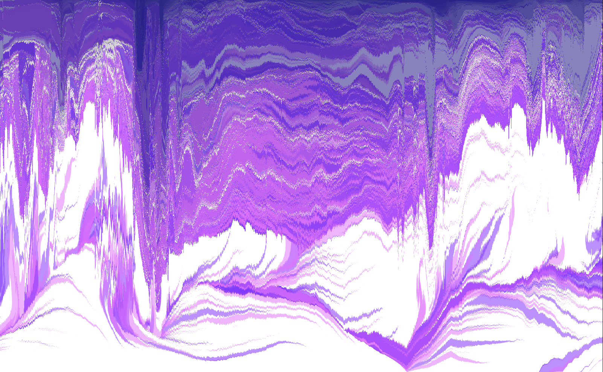
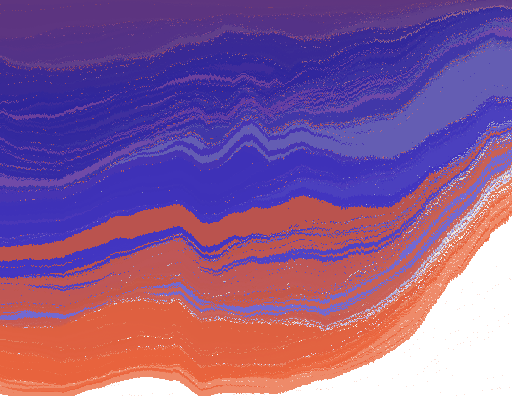

